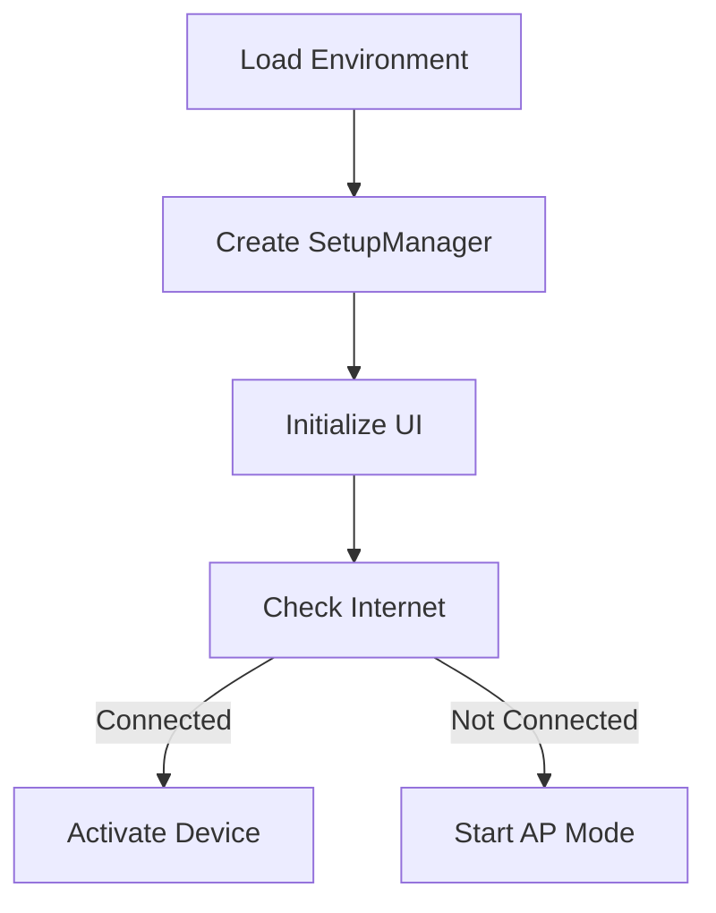
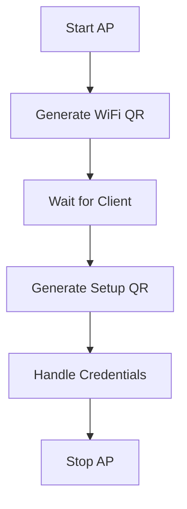
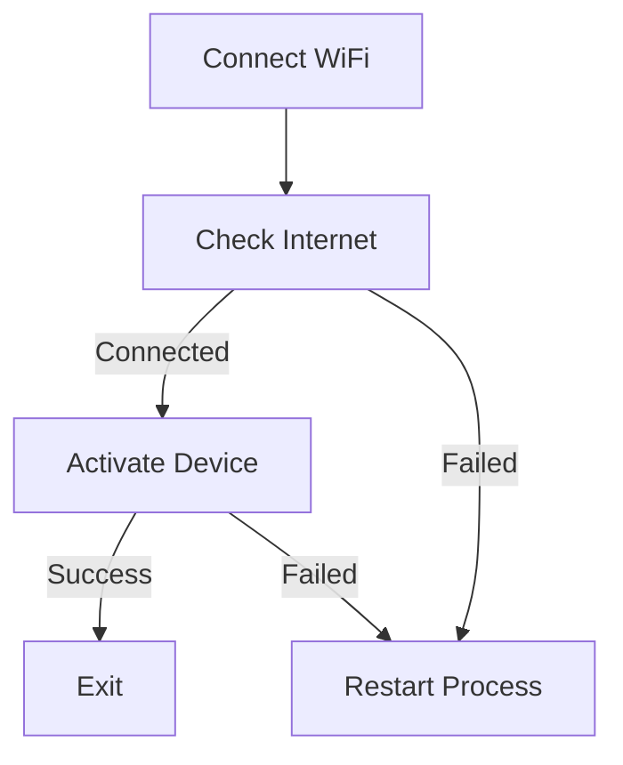

# Main Application Module


## 🔍 Overview
Core orchestration module for the Raspberry Pi Screen Management System. Manages the setup process, including network configuration, Access Point (AP) mode, and device activation through a user-friendly interface.

## 🔗 Related Documentation
- [UI Manager](ui_manager/UI%20Manager.md)
- [Server Documentation](server/Server.md)
- [Scripts Documentation](scripts/Scripts.md)

## ⭐ Features
- Automated setup process orchestration
- WiFi network configuration
- Access Point mode management
- Device activation handling
- QR code-based interaction
- Real-time status updates
- Error recovery mechanisms

## 📦 Dependencies
- `webview`: UI rendering
- `colorama`: Console output styling
- `python-dotenv`: Environment configuration
- `subprocess`: System command execution
- Custom modules:
  - `server.qr_code`: QR code generation
  - `scripts.connect_wifi`: WiFi connection
  - `scripts.send_activation`: Device activation
  - `ui_manager`: UI management

## 🎯 Core Components

### SetupManager Class
```python
class SetupManager:
    """
    Manages the Raspberry Pi setup process, including network configuration, 
    Access Point (AP) mode, and device activation.
    """
```

#### Key Methods
1. **Initialization**
```python
def __init__(self, server_url):
    """
    Initialize SetupManager with server URL.
    
    Args:
        server_url (str): URL of the activation server
    """
```

2. **Logging**
```python
def log(self, message, image_path=None):
    """
    Log messages to console and UI.
    
    Args:
        message (str): Message to log
        image_path (str, optional): Path to image for UI
    """
```

3. **Access Point Management**
```python
def start_ap_mode(self):
    """
    Start Access Point mode and handle QR code sequence.
    - Initializes AP
    - Generates WiFi QR code
    - Monitors client connection
    - Displays setup page QR code
    """

def stop_ap_mode(self):
    """
    Stop Access Point mode and reset DNS.
    - Stops AP services
    - Resets DNS configuration
    - Verifies configuration
    """
```

4. **Network Management**
```python
def check_internet_connection(self):
    """
    Check internet connectivity.
    
    Returns:
        bool: True if connected, False otherwise
    """

def verify_dns_config(self):
    """
    Verify DNS configuration.
    
    Returns:
        bool: True if configuration is valid
    """
```

5. **Device Activation**
```python
def activate_device(self):
    """
    Send activation request to server.
    
    Returns:
        bool: True if activation succeeds
    """
```

## 🔄 Setup Process Flow

### 1. Initialization


### 2. Access Point Mode


### 3. Device Activation


## ⚙️ Configuration

### Environment Variables
```bash
SERVER_URL=http://localhost:5001  # Activation server URL
```

### DNS Configuration
```python
DNS_SERVERS = [
    '8.8.8.8',  # Google DNS primary
    '8.8.4.4'   # Google DNS secondary
]
```

## 🔒 Security Features

### Credential Handling
- Temporary file storage
- Secure file deletion
- No plaintext logging

### Network Security
- WPA/WPA2 support
- DNS verification
- Connection validation

## 📊 Error Handling

### Recovery Mechanisms
1. **DNS Reset**
```python
max_attempts = 3
for attempt in range(max_attempts):
    if reset_dns():
        break
    time.sleep(2)
```

2. **Connection Retry**
```python
if not check_internet_connection():
    main()  # Restart process
```

### Error States
- Network connection failures
- DNS configuration issues
- Activation failures
- AP mode errors

## 📝 Usage Examples

### Basic Setup
```python
from main import SetupManager

setup = SetupManager("http://example.com")
setup.start_ap_mode()
```

### Custom Flow
```python
setup = SetupManager(server_url)
if setup.check_internet_connection():
    setup.activate_device()
else:
    setup.start_ap_mode()
    setup.handle_user_credentials()
```

## 🔍 Monitoring

### Progress Tracking
- Real-time status updates
- Connection monitoring
- Client device tracking
- Activation status

### Logging
- Console output with colors
- UI status updates
- Error tracking
- Process flow logging

## 🚀 Future Enhancements
1. Enhanced error recovery
2. Multiple network support
3. Automated testing
4. Performance monitoring
5. Security hardening
6. Extended device metrics
7. Backup configuration
8. Remote management

## 🔧 Troubleshooting

### Common Issues
1. **DNS Reset Failure**
   - Verify file permissions
   - Check network status
   - Review DNS servers

2. **AP Mode Issues**
   - Check hardware support
   - Verify driver compatibility
   - Review system logs

3. **Activation Failures**
   - Verify server URL
   - Check network connection
   - Review credentials

## 📚 Development Guidelines

### Adding Features
1. Update SetupManager class
2. Add error handling
3. Update documentation
4. Test thoroughly

### Testing
```bash
# Run basic setup
python main.py

# Test with custom server
SERVER_URL=http://custom.server python main.py
```

---
*Last updated: 2024-01-24*

Tags: #main #setup #raspberry-pi #wifi #ap-mode #activation #python 