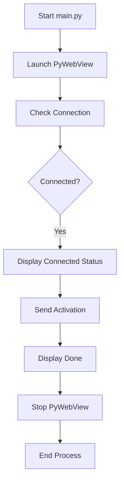
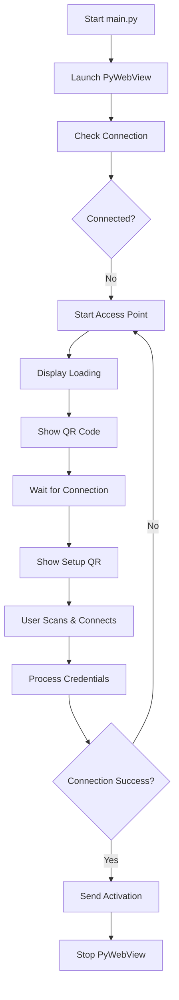

# Raspberry Pi Wi-Fi Configuration and Screen Management System

## 🎯 Overview

This project transforms Raspberry Pi devices into intelligent display management systems with automated Wi-Fi setup and screen activation capabilities.

## 🔄 System Workflows

### Connected Device Flow


### New Setup Flow


## 🛠️ Core Components

### 1. Network Management
- **Access Point Control**: `ap/setup_ap.sh`, `ap/stop_ap.sh`
- **Connection Monitoring**: `ap/check_connection.sh`
- **Wi-Fi Configuration**: `scripts/connect_wifi.py`

### 2. User Interface
- **Web Server**: Flask-based configuration portal
- **Display Manager**: PyWebView full-screen interface
- **QR Code Generator**: Easy network and setup access

### 3. System Services
- **Activation Client**: Device registration system
- **Status Monitor**: Real-time system feedback
- **Multi-language Support**: English/Spanish localization

## 📁 Project Structure

```
raspi-setup/
├── ap/                    # Access Point scripts
│   ├── setup_ap.sh       # AP initialization
│   ├── stop_ap.sh        # AP termination
│   └── check_connection.sh # Connectivity monitor
├── server/               # Web interface
│   ├── app.py           # Flask application
│   ├── qr_code.py       # QR generation
│   └── templates/       # HTML views
├── scripts/             # Core functionality
│   ├── connect_wifi.py  # Network connection
│   ├── send_activation.py # Device activation
│   └── stream_url.py    # Content streaming
└── ui_manager/          # PyWebView interface
```

## 🚀 Getting Started

### Prerequisites
- Raspberry Pi (3/4/Zero W)
- Raspbian OS (Bullseye+)
- Python 3.7+
- Connected display

### Installation

1. **Clone Repository**
```bash
git clone <repository-url>
cd raspi-setup
```

2. **Setup Environment**
```bash
python3 -m venv env
source env/bin/activate
pip install -r requirements.txt
```

3. **Configure System**
```bash
sudo chmod +x ap/*.sh
sudo chmod +x scripts/*.sh
```

4. **Environment Variables**
Create `.env`:
```bash
SERVER_URL=http://your-server:5001
SERVER_PORT=5001
FLASK_ENV=production
```

5. **Launch Application**
```bash
sudo python3 main.py
```

## 🔍 Development Guide

### Testing
```bash
# Full test suite
python -m pytest

# Component tests
python test_qr_display.py
python test_webview.py
```

### Adding Features
1. Create feature branch
2. Update components
3. Add translations if needed
4. Run tests
5. Submit PR

## 🐛 Troubleshooting

### Common Issues
1. **Network Connection Failed**
   - Check `logs/connection.log`
   - Verify network interface status
   - Review AP configuration

2. **Display Issues**
   - Confirm PyWebView installation
   - Check display connection
   - Verify permissions

3. **Activation Failed**
   - Check server connectivity
   - Verify credentials
   - Review `logs/activation.log`

## 📝 Notes

### Important Files
- [[main.py]] - Application entry point
- [[server/app.py]] - Web server implementation
- [[ui_manager/ui_manager.py]] - Display management

### Related
- [[Development Guide]]
- [[Troubleshooting Guide]]
- [[API Documentation]]

## 🤝 Contributing
1. Fork repository
2. Create feature branch
3. Follow coding standards
4. Add tests
5. Submit pull request

## 📄 License
[Your License]

## 💬 Support
[Contact Information]

---
*Last updated: [Current Date]*