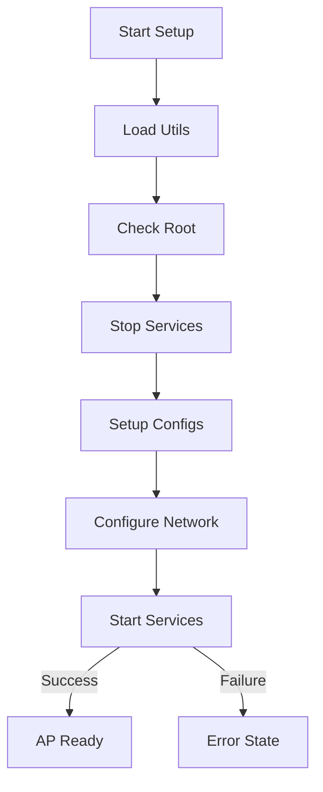
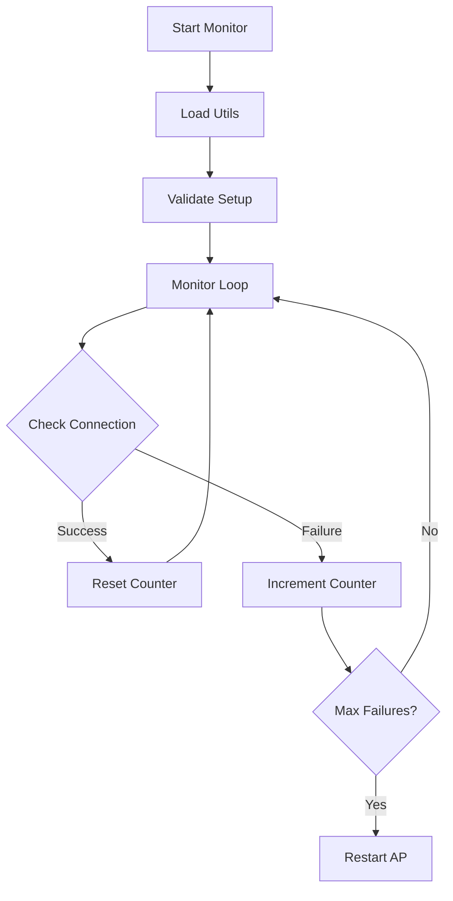
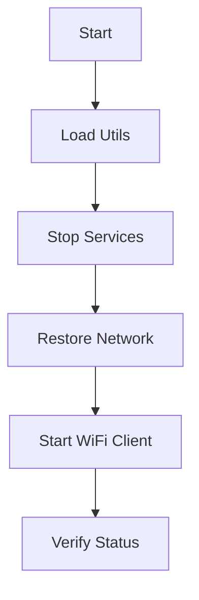

# Access Point Management

## 🔍 Overview

The Access Point (AP) management system provides scripts and functionality to create, manage, and monitor a Wi-Fi hotspot on the Raspberry Pi device. This system is crucial for initial device setup and network configuration.

## 📝 Key Components

### 1. Utility Functions (`utils.sh`)
Core functionality shared across all AP scripts:
- Timestamped logging with severity levels (ERROR, WARN, INFO, DEBUG)
- File-based logging support
- Service management utilities
- Network interface validation
- Configuration file handling
- Connectivity testing

### 2. AP Setup (`setup_ap.sh`)


#### Features
- Automated service management
- Configuration validation
- Network setup with IP forwarding
- Firewall configuration
- Comprehensive error handling
- Detailed logging

#### Usage
```bash
# Normal mode
sudo ./ap/setup_ap.sh

# Test mode (no service changes)
sudo ./ap/setup_ap.sh --test-mode
```

### 3. Connection Monitor (`check_connection.sh`)


#### Configuration
```bash
# Key settings (configurable at script start)
readonly AP_INTERFACE="wlan0"
readonly CHECK_INTERVAL=30     # seconds
readonly PING_TARGET="8.8.8.8" # Connectivity test target
readonly MAX_FAILURES=3        # Failures before restart
readonly LOG_FILE="/var/log/ap_monitor.log"
```

#### Usage
```bash
# Normal monitoring mode
sudo ./ap/check_connection.sh

# Test mode with timeout
sudo ./ap/check_connection.sh --test-mode --timeout 300
```

### 4. AP Termination (`stop_ap.sh`)


#### Usage
```bash
# Normal mode
sudo ./ap/stop_ap.sh

# Test mode (dry run)
sudo ./ap/stop_ap.sh --test-mode
```

## 🔧 Technical Details

### Service Dependencies
- `hostapd`: Access Point daemon
- `dnsmasq`: DHCP and DNS services
- `dhcpcd`: DHCP client daemon
- `wpa_supplicant`: WiFi client mode

### Network Configuration

#### DHCP Settings (`dnsmasq.conf`)
```conf
interface=wlan0
dhcp-range=192.168.4.2,192.168.4.20,255.255.255.0,24h
domain=wlan
address=/gw.wlan/192.168.4.1
```

#### AP Configuration (`hostapd.conf`)
```conf
interface=wlan0
driver=nl80211
ssid=RaspberryPi_AP
hw_mode=g
channel=7
wmm_enabled=0
macaddr_acl=0
auth_algs=1
ignore_broadcast_ssid=0
wpa=2
wpa_passphrase=raspberry
wpa_key_mgmt=WPA-PSK
wpa_pairwise=TKIP
rsn_pairwise=CCMP
```

## 📊 Monitoring and Logs

### Log Files
- AP Setup: `/var/log/ap_setup.log`
- Connection Monitor: `/var/log/ap_monitor.log`
- AP Termination: `/var/log/ap_stop.log`

### Service Status
```bash
# View AP service status
sudo systemctl status hostapd

# Check DHCP server
sudo systemctl status dnsmasq

# View detailed logs
sudo journalctl -u hostapd
sudo journalctl -u dnsmasq
```

## 🔒 Security Best Practices

### 1. Access Point Security
- WPA2 encryption enabled by default
- Configurable SSID and passphrase
- Optional SSID hiding
- MAC address filtering capability

### 2. Network Security
```conf
# Recommended hostapd security settings
auth_algs=1          # 1=WPA, 2=WEP, 3=both
wpa=2                # WPA2 only
wpa_key_mgmt=WPA-PSK
rsn_pairwise=CCMP    # Strongest encryption
```

### 3. Firewall Configuration
- Minimal port exposure (only port 80 for web interface)
- Configurable firewall rules
- IP forwarding control

## 🛠️ Troubleshooting Guide

### Common Issues and Solutions

1. **AP Fails to Start**
```bash
# Check logs
sudo tail -f /var/log/ap_setup.log

# Verify configurations
sudo cat /etc/hostapd/hostapd.conf
sudo cat /etc/dnsmasq.conf
```

2. **Connection Monitoring Issues**
```bash
# View monitor logs
sudo tail -f /var/log/ap_monitor.log

# Test connectivity manually
ping -c 1 8.8.8.8
```

3. **Network Interface Problems**
```bash
# Check interface status
ip link show wlan0
iwconfig wlan0

# Restart interface
sudo ip link set wlan0 down
sudo ip link set wlan0 up
```

## 🔄 Integration Notes

### Script Dependencies
- All scripts require root privileges
- Utils module must be present in the same directory
- Configuration files must exist in ../config/

### Error Handling
- Comprehensive error checking
- Detailed logging with timestamps
- Automatic recovery attempts
- Graceful failure handling

## 📚 Related Documentation
- [[Development Guide]] - Development setup and guidelines
- [[API Documentation]] - API endpoints and usage
- [[System Architecture]] - Overall system design
- [[Troubleshooting Guide]] - Detailed troubleshooting steps

---
*Last updated: 2024-01-24* 