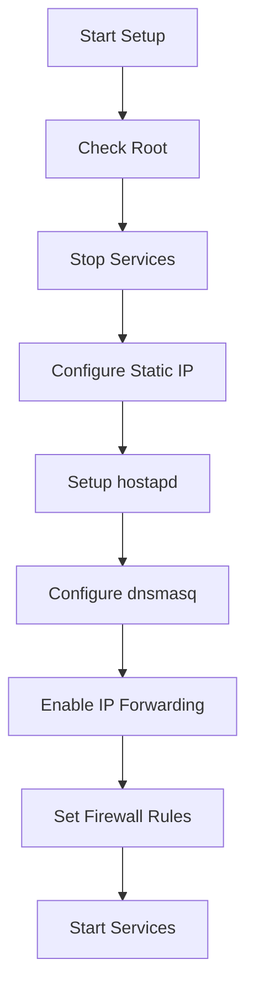
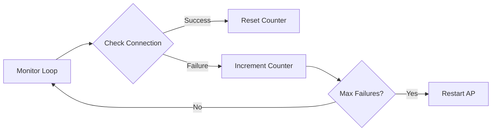
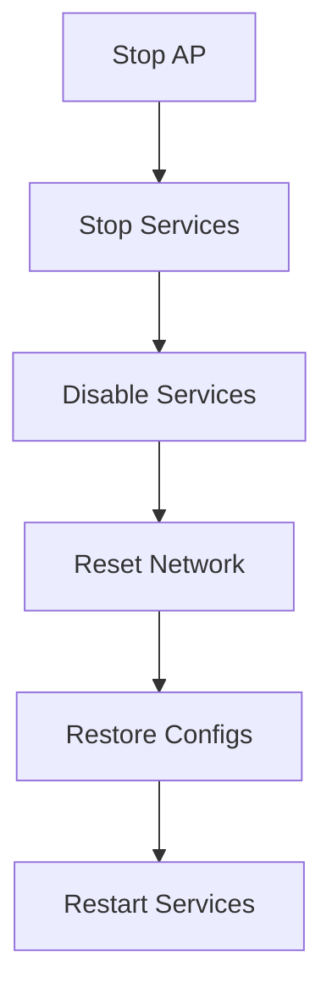

# Access Point Management

## 🔍 Overview

The Access Point (AP) management system provides scripts and functionality to create, manage, and monitor a Wi-Fi hotspot on the Raspberry Pi device. This system is crucial for initial device setup and network configuration.

## 🚀 Core Scripts

### 1. AP Setup (`setup_ap.sh`)


#### Key Features
- Static IP configuration (192.168.4.1)
- WPA2 security
- DHCP server configuration
- IP forwarding setup
- Firewall rules management

#### Usage
```bash
sudo ./ap/setup_ap.sh
```

### 2. Connection Monitor (`check_connection.sh`)


#### Configuration
```bash
AP_INTERFACE="wlan0"
CHECK_INTERVAL=30  # seconds
PING_TARGET="8.8.8.8"
MAX_FAILURES=3
```

### 3. AP Termination (`stop_ap.sh`)


## 🔧 Technical Details

### Network Configuration

#### DHCP Settings
```conf
interface=wlan0
dhcp-range=192.168.4.2,192.168.4.20,255.255.255.0,24h
```

#### AP Configuration
```conf
interface=wlan0
driver=nl80211
ssid=RaspberryPi_AP
hw_mode=g
channel=7
wpa=2
wpa_passphrase=raspberry
```

## 📊 Monitoring and Maintenance

### Status Checking
```bash
# Check AP status
systemctl status hostapd

# Check DHCP server
systemctl status dnsmasq

# Monitor connections
iwconfig wlan0
```

### Log Monitoring
```bash
# View hostapd logs
journalctl -u hostapd

# View dnsmasq logs
journalctl -u dnsmasq

# Monitor connection checks
tail -f /var/log/syslog | grep "check_connection"
```

## 🔒 Security Considerations

### 1. Network Security
- WPA2 encryption enabled
- Hidden SSID option available
- MAC address filtering support
- Secure default configuration

### 2. Access Control
```conf
# hostapd.conf security settings
auth_algs=1
wpa=2
wpa_key_mgmt=WPA-PSK
rsn_pairwise=CCMP
```

## 🛠️ Troubleshooting

### Common Issues

1. **AP Not Starting**
   ```bash
   # Check configuration
   cat /etc/hostapd/hostapd.conf
   # Verify service status
   systemctl status hostapd
   ```

2. **DHCP Problems**
   ```bash
   # Check DHCP configuration
   cat /etc/dnsmasq.conf
   # View DHCP leases
   cat /var/lib/misc/dnsmasq.leases
   ```

3. **Connection Monitoring Issues**
   ```bash
   # Check script permissions
   chmod +x check_connection.sh
   # Test ping target
   ping -c 1 8.8.8.8
   ```

## 📝 Integration Points

### 1. System Integration
- Automatic AP activation on network failure
- Integration with main application flow
- Status reporting to UI

### 2. Network Management
```python
# Example: Check AP status from Python
def check_ap_status():
    result = subprocess.run(['systemctl', 'is-active', 'hostapd'], 
                          capture_output=True, text=True)
    return result.stdout.strip() == 'active'
```

## 🔄 Workflow Integration

### Setup Process
1. System startup
2. Network check
3. AP initialization if needed
4. Client connection handling
5. Network configuration
6. AP termination

### Monitoring Process
1. Continuous connection checking
2. Failure detection
3. Automatic recovery
4. Status reporting

## 📚 Related Documentation
- [[Development Guide]] - Development setup and guidelines
- [[API Documentation]] - API endpoints and usage
- [[System Architecture]] - Overall system design
- [[Troubleshooting Guide]] - General troubleshooting
- [[README]] - Project overview

---
*Last updated: [Current Date]* 