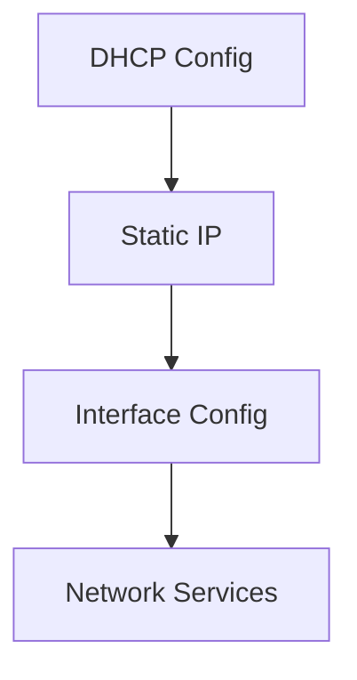

# Configuration System

## 🔍 Overview

The configuration system manages various service configurations, network settings, and system parameters for the Raspberry Pi Screen Management System.

## 📁 Configuration Files

### 1. DHCP Configuration (`dhcpcd.conf`)
```conf
interface wlan0
static ip_address=192.168.4.1/24
denyinterfaces eth0
```

#### Purpose
- Configures network interface settings
- Sets static IP for Access Point mode
- Manages interface priorities

### 2. DNS Server (`dnsmasq.conf`)
```conf
interface=wlan0
dhcp-range=192.168.4.2,192.168.4.20,255.255.255.0,24h
```

#### Purpose
- DHCP server configuration
- DNS forwarding settings
- IP range management

### 3. Access Point (`hostapd.conf`)
```conf
interface=wlan0
driver=nl80211
ssid=RaspberryPi_AP
hw_mode=g
channel=7
macaddr_acl=0
auth_algs=1
ignore_broadcast_ssid=0
wpa=2
wpa_passphrase=raspberry
wpa_key_mgmt=WPA-PSK
rsn_pairwise=CCMP
```

## 🔧 Configuration Management

### Environment Variables
```bash
# .env file structure
SERVER_URL=http://localhost:5001
SERVER_PORT=5001
FLASK_ENV=production
PYTHONUNBUFFERED=1
```

### Docker Environment
```yaml
environment:
  - FLASK_APP=server/app.py
  - FLASK_ENV=production
  - SERVER_PORT=5001
  - SERVER_URL=http://192.168.0.99:5001
  - TZ=Europe/Paris
```

## 📊 Network Configuration

### Static IP Setup


### Interface Management
1. **WLAN Configuration**
   ```conf
   interface wlan0
   static ip_address=192.168.4.1/24
   ```

2. **Ethernet Configuration**
   ```conf
   denyinterfaces eth0
   ```

## 🔒 Security Configuration

### 1. Access Point Security
```conf
# WPA2 Settings
wpa=2
wpa_key_mgmt=WPA-PSK
rsn_pairwise=CCMP
```

### 2. File Permissions
```bash
# Secure configuration files
chmod 600 config/*.conf
```

## 🛠️ Configuration Management Tools

### 1. Config Validation
```python
def validate_config():
    """Validate configuration files"""
    check_dhcp_config()
    check_hostapd_config()
    check_dnsmasq_config()
```

### 2. Config Generation
```python
def generate_config(template, values):
    """Generate configuration from template"""
    with open(template, 'r') as f:
        content = f.read()
    return content.format(**values)
```

## 📡 Service Configurations

### 1. Flask Server
```python
# Flask configuration
app.config.update(
    SECRET_KEY=os.urandom(24),
    SESSION_COOKIE_SECURE=True,
    PERMANENT_SESSION_LIFETIME=1800
)
```

### 2. Logging Configuration
```python
logging.basicConfig(
    filename='logs/app.log',
    level=logging.INFO,
    format='[%(asctime)s] %(levelname)s: %(message)s'
)
```

## 🔄 Configuration Updates

### Manual Updates
1. Edit configuration files
2. Validate changes
3. Restart affected services
4. Verify functionality

### Automated Updates
```python
def update_config(config_file, updates):
    """Update configuration with new values"""
    backup_config(config_file)
    apply_updates(config_file, updates)
    validate_config()
    restart_services()
```

## ⚠️ Common Configuration Issues

### 1. Network Conflicts
- IP address conflicts
- Interface naming issues
- DHCP range overlaps

### 2. Permission Problems
- File ownership
- Access rights
- Service permissions

## 📝 Configuration Best Practices

1. **Version Control**
   - Track configuration changes
   - Maintain backups
   - Document modifications

2. **Security**
   - Secure sensitive data
   - Use environment variables
   - Implement access controls

3. **Validation**
   - Check syntax
   - Verify values
   - Test changes

## 🔗 Related Documentation
- [[AP]] - Access Point setup and management
- [[Development Guide]] - Development environment setup
- [[System Architecture]] - System design and components
- [[Troubleshooting Guide]] - Issue resolution
- [[README]] - Project overview

---
*Last updated: [Current Date]* 