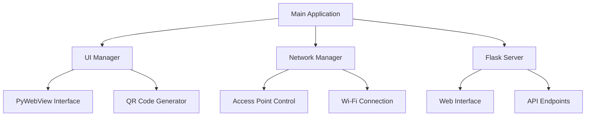
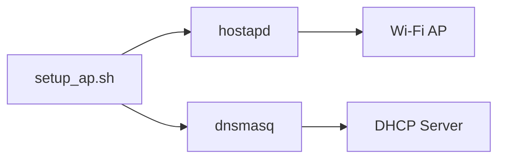
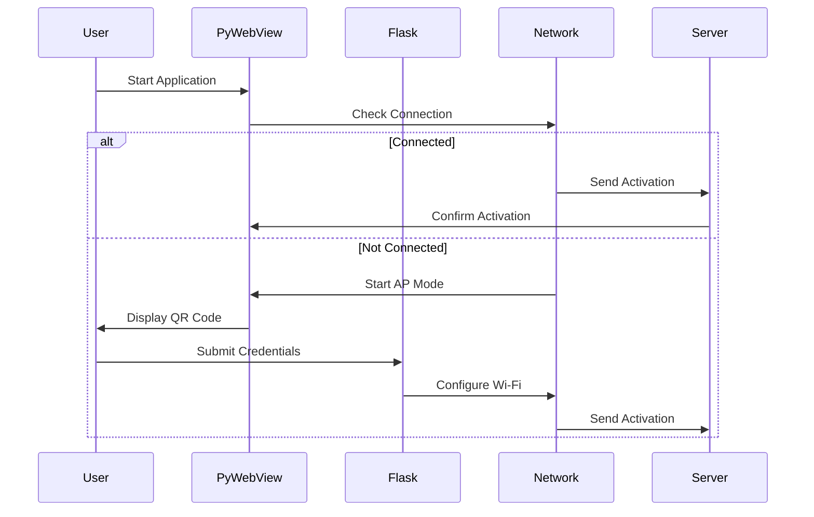
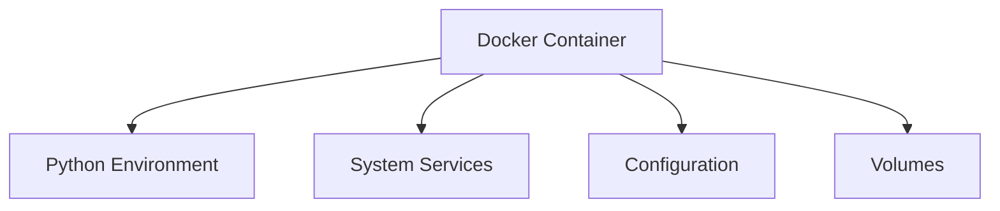

# System Architecture

## 🏗️ High-Level Overview



## 🔄 Core Components

### 1. Main Application Layer
- **Entry Point**: `main.py`
- **Setup Manager**: Orchestrates system initialization and workflow
- **Process Management**: Handles multi-process operations

```python
class SetupManager:
    def __init__(self, server_url):
        self.activation_client = ActivationClient(server_url)
        self.ui_manager = UIManager()
```

### 2. User Interface Layer

#### PyWebView Interface (`ui_manager/`)
- Full-screen display management
- Status updates and notifications
- QR code presentation

```python
class UIManager:
    def create_ui(self, ready_callback):
        """Initialize PyWebView window"""
        
    def display_qr_code(self, qr_path, message):
        """Show QR code with status message"""
```

#### Web Interface (`server/templates/`)
- Configuration forms
- Network selection
- Status feedback
- Multi-language support

## 🌐 Network Management Layer

### 1. Access Point Control (`ap/`)


### 2. Network Configuration
- **Connection Manager**: `scripts/connect_wifi.py`
- **DNS Management**: `reset_dns()`
- **Network Monitoring**: `ap/check_connection.sh`

## 🔒 Security Architecture

### 1. Input Validation
```python
def sanitize_input(text: str) -> str:
    """Sanitize user input using bleach"""
    return bleach.clean(text, strip=True)
```

### 2. Network Security
- WPA2 encryption for AP
- Secure credential handling
- Temporary file management

### 3. Access Control
- Service-level permissions
- File system restrictions
- Network interface management

## 📡 Communication Flow



## 💾 Data Flow

### 1. Configuration Data


### 2. Status Information
- System metrics
- Network status
- Service states
- Error logging

## 🔧 Service Layer

### 1. System Services
- **hostapd**: Access Point daemon
- **dnsmasq**: DHCP and DNS
- **Flask**: Web server
- **PyWebView**: Display management

### 2. Docker Services
```yaml
services:
  raspi-screen:
    build: .
    ports:
      - "80:80"
      - "5001:5001"
    volumes:
      - ./logs:/app/logs
      - ./static:/app/static
      - ./config:/app/config
```

## 📊 Monitoring and Logging

### 1. System Metrics
```python
def get_system_info():
    return {
        'temperature': get_cpu_temp(),
        'cpu_usage': get_cpu_usage(),
        'memory_used': get_memory_usage(),
        'disk_usage': get_disk_usage()
    }
```

### 2. Log Management
- Rotating file handlers
- Structured logging
- Multiple log levels
- Service-specific logs

## 🔌 Integration Points

### 1. External Services
- Activation server
- Content delivery
- Time synchronization
- Package management

### 2. Hardware Integration
- Display interface
- Network adapters
- System resources
- GPIO controls

## 🚀 Deployment Architecture

### 1. Container Structure


### 2. Resource Management
- Memory limits
- CPU allocation
- Storage volumes
- Network ports

## ⚡ Performance Considerations

### 1. Resource Optimization
- Efficient process management
- Memory usage monitoring
- Cache management
- Network bandwidth control

### 2. Error Handling
- Graceful degradation
- Service recovery
- Error logging
- User feedback

## 📈 Scalability Aspects

### 1. Multi-Device Management
- Unique device identification
- Centralized monitoring
- Configuration management
- Update distribution

### 2. Future Expansion
- Additional service integration
- Enhanced monitoring
- Feature modularity
- Performance optimization

---
*See also: [[Development Guide]], [[Troubleshooting Guide]]*
