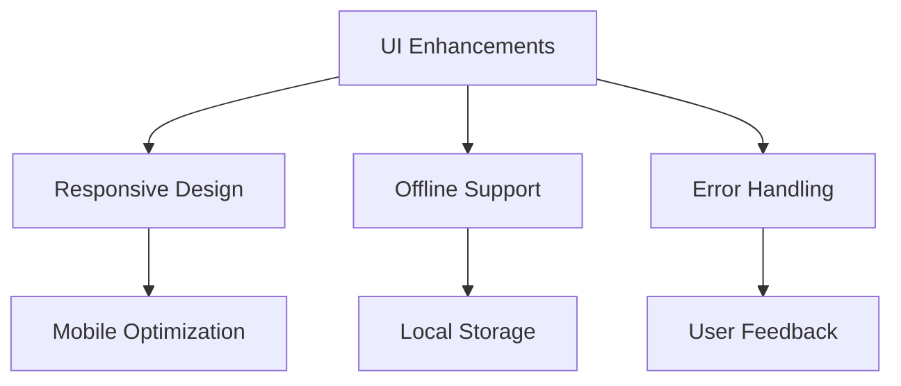
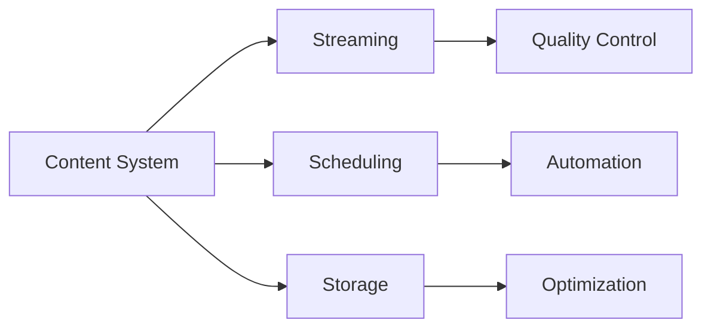
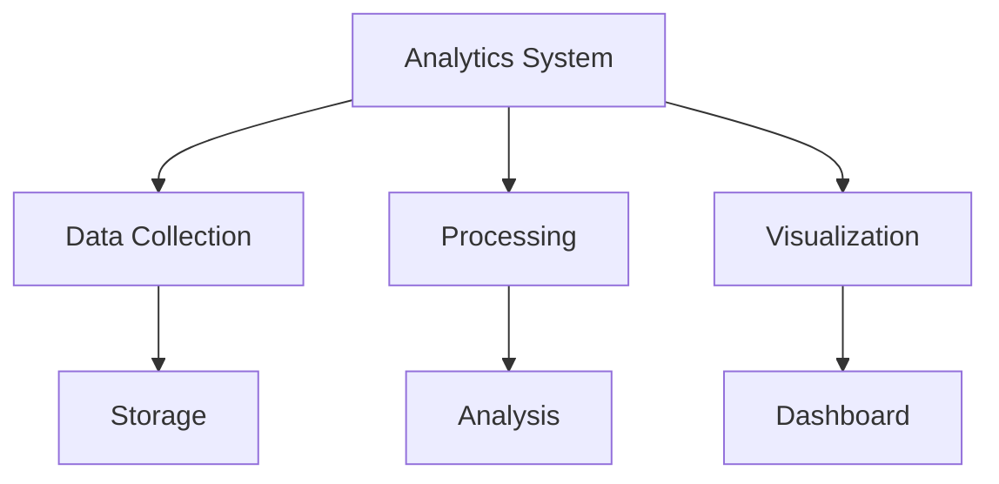

# Project TODO List

## 🎯 High Priority

### Security Enhancements
- [ ] Implement token-based authentication for API endpoints
- [ ] Add HTTPS support for local server
- [ ] Secure storage for Wi-Fi credentials
- [ ] Implement rate limiting for API endpoints
- [ ] Add input validation middleware

### Network Management
- [ ] Implement automatic network reconnection
- [ ] Add network quality monitoring
- [ ] Create fallback mechanism for connection failures
- [ ] Improve AP mode stability
- [ ] Add support for enterprise Wi-Fi networks

### UI/UX Improvements

- [ ] Add offline mode support
- [ ] Improve error message clarity
- [ ] Implement dark mode toggle persistence
- [ ] Add loading indicators for all operations
- [ ] Enhance mobile responsiveness

## 🔄 System Stability

### Error Handling
- [ ] Implement global error boundary
- [ ] Add automatic error reporting
- [ ] Create recovery procedures for common failures
- [ ] Improve logging detail and organization
- [ ] Add system health monitoring

### Performance Optimization
- [ ] Optimize QR code generation
- [ ] Implement caching for network scans
- [ ] Reduce memory usage in PyWebView
- [ ] Optimize template rendering
- [ ] Add resource usage monitoring

## 📱 Feature Additions

### Multi-Device Support
- [ ] Implement device grouping
- [ ] Add central management interface
- [ ] Create device synchronization
- [ ] Add device-specific configurations
- [ ] Implement remote management

### Content Management

- [ ] Add content scheduling system
- [ ] Implement content caching
- [ ] Add support for offline content
- [ ] Create content rotation system
- [ ] Add content verification

## 🔧 Development Tools

### Testing Infrastructure
- [ ] Add end-to-end testing suite
- [ ] Implement integration tests
- [ ] Add performance benchmarking
- [ ] Create automated UI testing
- [ ] Add network simulation tests

### Documentation
- [ ] Create API versioning documentation
- [ ] Add deployment guides
- [ ] Improve code documentation
- [ ] Create video tutorials
- [ ] Add troubleshooting flowcharts

## 🌐 Internationalization

### Language Support
- [ ] Add additional language support:
  - [ ] German
  - [ ] French
  - [ ] Chinese
  - [ ] Japanese
- [ ] Implement RTL language support
- [ ] Add language auto-detection

## 📊 Monitoring & Analytics

### System Metrics
- [ ] Implement performance monitoring
- [ ] Add usage analytics
- [ ] Create system health dashboard
- [ ] Add network quality metrics
- [ ] Implement error tracking

### Reporting

- [ ] Create usage reports
- [ ] Add performance reporting
- [ ] Implement error reporting
- [ ] Add network statistics
- [ ] Create system health reports

## 🔌 Integration Points

### External Systems
- [ ] Add REST API documentation
- [ ] Implement webhook support
- [ ] Create integration examples
- [ ] Add authentication options
- [ ] Implement API versioning

### Hardware Support
- [ ] Add support for additional Pi models
- [ ] Implement custom display configurations
- [ ] Add external device support
- [ ] Create hardware diagnostics
- [ ] Add sensor integration

## 🔗 Related Documentation
- [[Development Guide]] - Development setup and guidelines
- [[System Architecture]] - System design and components
- [[API Documentation]] - API endpoints and usage
- [[Troubleshooting Guide]] - Issue resolution steps

---
*Last updated: [Current Date]* 