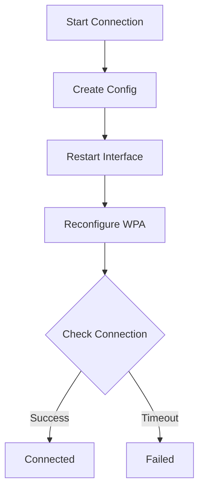
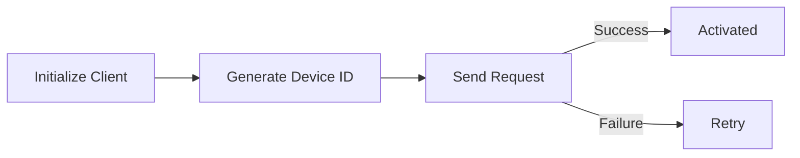
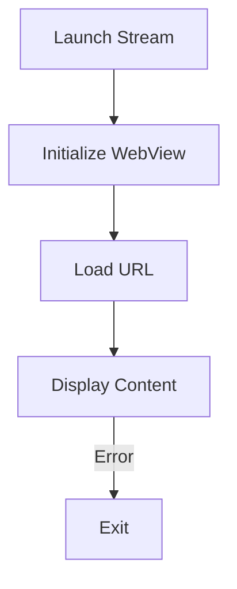

# Scripts Documentation

## 🔍 Overview

The scripts directory contains core Python modules that handle Wi-Fi connectivity, device activation, and content streaming functionality.

## 🌐 Network Management

### Connect Wi-Fi (`connect_wifi.py`)



#### Key Functions

```python
def connect_wifi(ssid: str, password: str, timeout: int = 30) -> bool:
    """
    Connect to Wi-Fi network with status tracking.
    
    Args:
        ssid: Network name
        password: Network password
        timeout: Connection timeout in seconds
        
    Returns:
        bool: Connection success status
    """
```

#### DNS Management
```python
def reset_dns() -> bool:
    """
    Reset DNS to Google's public servers (8.8.8.8, 8.8.4.4).
    Returns success status.
    """
```

## 🔐 Device Activation

### Activation Client (`send_activation.py`)



#### Core Class
```python
class ActivationClient:
    """
    Manages device activation with central server.
    
    Attributes:
        server_url: Central server endpoint
        device_id: Unique device identifier
    """
```

#### Key Methods
- `_get_device_id()`: Generate unique device ID
- `send_activation_request()`: Send activation to server

#### Example Usage
```python
client = ActivationClient(server_url="http://localhost:5001")
success, result = client.send_activation_request()
```

## 📺 Content Streaming

### Stream URL Handler (`stream_url.py`)



#### Main Function
```python
def launch_streaming(url: str = None):
    """
    Launch fullscreen PyWebView window for content streaming.
    
    Args:
        url: Content streaming URL (optional)
    """
```

#### Features
- Fullscreen display
- Error handling
- Default URL fallback
- Clean exit handling

## 🔄 Integration Flow

### Network Setup Process
1. Initialize connection
2. Configure network
3. Verify connectivity
4. Reset DNS if needed

### Activation Process
1. Generate device ID
2. Send activation request
3. Handle response
4. Configure streaming

### Content Display
1. Receive stream URL
2. Initialize display
3. Monitor connection
4. Handle errors

## 🛠️ Development Usage

### Wi-Fi Connection
```python
from scripts.connect_wifi import connect_wifi

# Connect to network
if connect_wifi("NetworkName", "Password"):
    print("Connected successfully")
```

### Device Activation
```python
from scripts.send_activation import ActivationClient

# Initialize and activate
client = ActivationClient("http://server:5001")
success, result = client.send_activation_request()
```

### Content Streaming
```python
from scripts.stream_url import launch_streaming

# Start streaming
launch_streaming("http://content-url")
```

## 🔧 Error Handling

### Network Errors
- Connection timeouts
- Invalid credentials
- Interface problems
- DNS configuration failures

### Activation Errors
- Server connectivity
- Invalid device ID
- Authentication failures
- Timeout handling

### Streaming Errors
- Display initialization
- Content loading
- Connection drops
- Resource management

## 📊 Logging and Monitoring

### Network Logging
```python
# Connection status logging
print(f"Connecting to {ssid}...")
print("Wi-Fi configuration written.")
print("Restarting wireless interface...")
```

### Activation Logging
```python
# Activation status
print("Device activation successful!")
print(f"Server response: {result}")
```

### Stream Logging
```python
# Stream status
print(f"Launching streaming URL: {stream_url}")
print(f"Error launching streaming URL: {e}")
```

## 🔗 Related Documentation
- [[AP]] - Access Point management
- [[Config]] - Configuration system
- [[Development Guide]] - Development setup
- [[System Architecture]] - System design
- [[API Documentation]] - API endpoints

## 🚀 Future Enhancements

### Planned Features
1. Enhanced error recovery
2. Connection quality monitoring
3. Automated reconnection
4. Performance metrics
5. Advanced logging

### Integration Points
1. Status reporting
2. Configuration management
3. Service monitoring
4. Update handling

---
*Last updated: [Current Date]* 