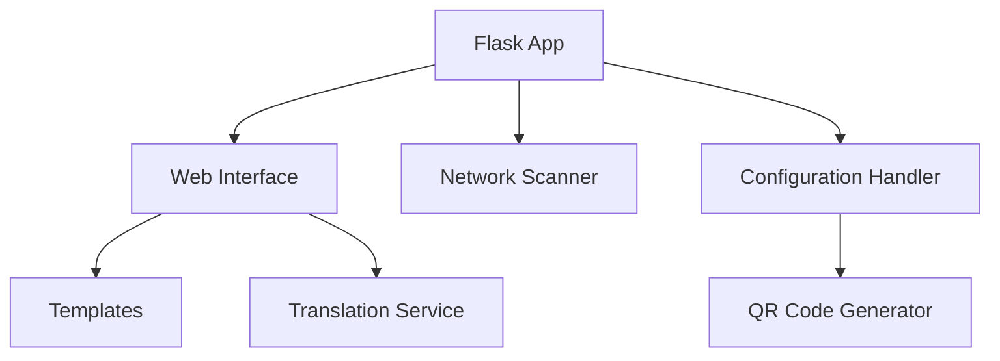

# Server Documentation

## 🔍 Overview

The server component provides a Flask-based web interface for Wi-Fi configuration and device setup, along with QR code generation capabilities and multi-language support.

## 🌐 Web Server (`app.py`)

### Core Components


### Key Routes

#### 1. Home Page
```python
@app.route('/')
def index():
    """Serve the Wi-Fi setup page."""
    return render_template('index.html')
```

#### 2. Network Configuration
```python
@app.route('/configure', methods=['POST'])
def submit():
    """Handle Wi-Fi credentials submission."""
```

#### 3. Network Scanning
```python
@app.route('/scan', methods=['GET'])
def scan_networks():
    """Scan for available Wi-Fi networks."""
```

## 📱 User Interface

### Templates Structure
```
server/templates/
├── index.html    # Main configuration page
├── success.html  # Success confirmation
└── error.html    # Error handling
```

### Template Features
1. **Index Page**
   - Network selection
   - Password input
   - Dark mode toggle
   - Language switching
   - Progress indicators

2. **Success Page**
   - Completion confirmation
   - Visual feedback
   - Return navigation

3. **Error Page**
   - Error display
   - Recovery options
   - Back navigation

## 🎨 UI Components

### Network Selection
```html
<div class="mb-3">
    <label class="form-label">Select Network</label>
    <div class="input-group">
        <select class="form-select" id="ssid" name="ssid" required>
            <option value="">Choose a network...</option>
        </select>
        <input type="text" class="form-control" id="manualSsid">
        <button class="btn btn-primary" type="button" id="scanButton">
            Scan
        </button>
    </div>
</div>
```

### Progress Indicator
```html
<div class="step-indicator">
    <div class="step active">{{ t('steps.scan') }}</div>
    <div class="step">{{ t('steps.select') }}</div>
    <div class="step">{{ t('steps.connect') }}</div>
</div>
```

## 🔄 QR Code Generation (`qr_code.py`)

### Core Functions
```python
def generate_qr_code(data, output_file, qr_type="wifi"):
    """
    Generate QR codes for Wi-Fi or URL data.
    
    Args:
        data: Wi-Fi credentials or URL
        output_file: Output path
        qr_type: "wifi" or "url"
    """
```

### Usage Examples
```python
# Generate Wi-Fi QR
wifi_qr = generate_wifi_qr(
    ssid="NetworkName",
    password="Password123",
    output_file="wifi_qr.png"
)

# Generate URL QR
url_qr = generate_url_qr(
    url="http://setup.local",
    output_file="url_qr.png"
)
```

## 🌍 Internationalization

### Translation Service
```python
class TranslationService:
    def __init__(self):
        self.translations = {}
        self.load_translations()
```

### Language Files
```
translations/
├── en.json    # English
└── es.json    # Spanish
```

### Usage
```python
# In templates
{{ t('network.select') }}

# In Python
translation = translation_service.get_translation('network.select')
```

## 🔒 Security Features

### 1. Input Sanitization
```python
def sanitize_input(text: str) -> str:
    """Sanitize user input using bleach."""
    return bleach.clean(text, strip=True)
```

### 2. Error Handling
```python
try:
    # Operation
    pass
except Exception as e:
    app.logger.error(f"Operation failed: {str(e)}")
    return jsonify({
        'status': 'error',
        'message': str(e)
    })
```

## 📝 Logging System

### Configuration
```python
def setup_logging():
    """Configure rotating file handler."""
    handler = RotatingFileHandler(
        '/var/log/wifi_setup.log',
        maxBytes=1024*1024,
        backupCount=5
    )
```

### Log Levels
- INFO: Normal operations
- WARNING: Potential issues
- ERROR: Operation failures
- DEBUG: Detailed information

## 🔌 Integration Points

### 1. Network Management
- Wi-Fi scanning
- Connection handling
- Status monitoring

### 2. Frontend Integration
- Real-time updates
- Status feedback
- Error display

### 3. System Integration
- QR code generation
- Configuration management
- Service control

## ⚡ Performance Considerations

### 1. Response Times
- Async network scanning
- Efficient QR generation
- Optimized template rendering

### 2. Resource Usage
- Rotating logs
- Memory management
- Cache control

## 🔧 Development Guidelines

### 1. Adding Routes
```python
@app.route('/new-endpoint', methods=['GET', 'POST'])
def new_endpoint():
    """Template for new endpoints."""
    try:
        # Implementation
        return jsonify({'status': 'success'})
    except Exception as e:
        app.logger.error(str(e))
        return jsonify({'status': 'error'})
```

### 2. Template Updates
1. Add translations
2. Update styling
3. Add JavaScript handlers
4. Test responsiveness

## 🔗 Related Documentation
- [[API Documentation]] - API endpoints
- [[Development Guide]] - Development setup
- [[System Architecture]] - System design
- [[Scripts]] - Backend scripts
- [[Config]] - Configuration system

---
*Last updated: [Current Date]* 