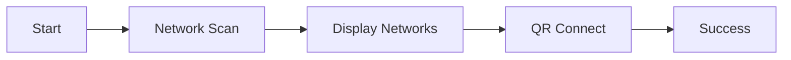
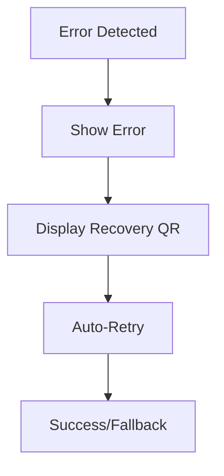
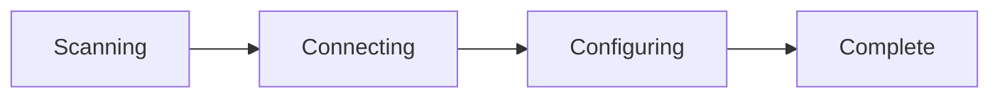
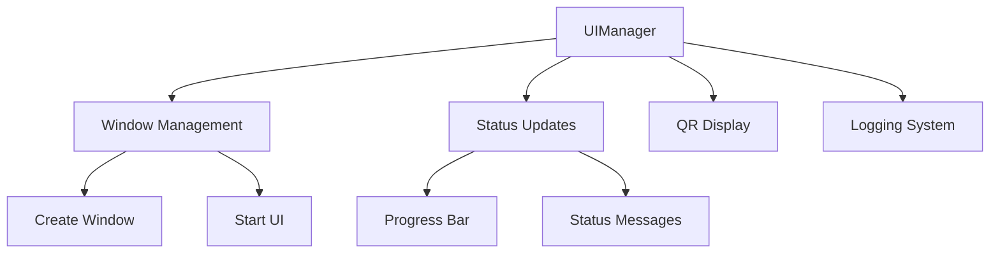
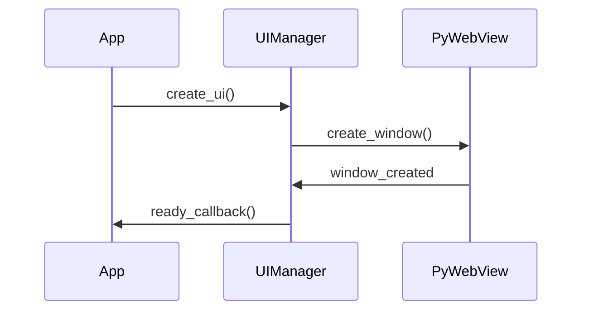

# UI Manager Module


## 🔍 Overview
Advanced UI management system for the Raspberry Pi Screen Management Server, providing a responsive and user-friendly interface with real-time updates, QR code integration, and visual feedback mechanisms.

## 🔗 Related Documentation
- [Server Documentation](../server/Server.md)
- [QR Code Module](../server/qr_code.md)

## ⭐ Features
- Progressive UI flow with automatic transitions
- Real-time status updates via WebSocket
- Dynamic QR code generation and display
- Visual feedback with animations
- Accessibility-focused design
- Error recovery mechanisms
- Offline support

## 📦 Dependencies
- `pywebview>=3.5`: Web UI rendering
- `websockets>=10.0`: Real-time updates
- Custom server utilities

## 🎨 UI Components

### Screen Layout
```
+----------------------------------+
|           Status Bar             |
|----------------------------------|
|                                  |
|         Primary Content          |
|         (QR Code/Info)          |
|                                  |
|----------------------------------|
|        Action Feedback           |
+----------------------------------+
```

### Status Indicators
- Progress bar for ongoing operations
- Animated spinners for loading states
- Color-coded status messages
- Countdown timers for transitions

### QR Code Display
- Primary action QR code (center)
- Fallback/help QR code (corner)
- Dynamic refresh on status change
- Multi-action QR support

## 🔄 User Journey

### 1. Initial Setup


### 2. Error Recovery


### 3. Status Transitions


## ⚙️ Configuration

### Screen States
```python
STATES = {
    'INIT': {
        'message': 'Initializing...',
        'color': '#007bff',
        'timeout': 5
    },
    'SCANNING': {
        'message': 'Scanning networks...',
        'color': '#ffc107',
        'timeout': 30
    },
    'CONNECTING': {
        'message': 'Connecting to network...',
        'color': '#17a2b8',
        'timeout': 60
    },
    'SUCCESS': {
        'message': 'Connected successfully!',
        'color': '#28a745',
        'timeout': 10
    },
    'ERROR': {
        'message': 'Connection failed',
        'color': '#dc3545',
        'timeout': 15
    }
}
```

### Visual Themes
```python
THEMES = {
    'light': {
        'background': '#ffffff',
        'text': '#000000',
        'accent': '#007bff'
    },
    'dark': {
        'background': '#1a1a1a',
        'text': '#ffffff',
        'accent': '#00a0ff'
    }
}
```

## 🎯 Core Functions

### UI Lifecycle Management
```python
def initialize_ui():
    """Initialize UI components and WebSocket connection."""

def update_state(state: str):
    """Update UI state with transitions and animations."""

def handle_error(error: Exception):
    """Display error and recovery options."""
```

### QR Code Management
```python
def display_qr(data: dict):
    """Display QR code with optional fallback."""

def refresh_qr():
    """Regenerate and update displayed QR code."""
```

### WebSocket Integration
```python
def connect_websocket():
    """Establish WebSocket connection for updates."""

def handle_message(message: dict):
    """Process incoming WebSocket messages."""
```

## ⚠️ Error Handling

### Recovery Mechanisms
1. Automatic retry with exponential backoff
2. Fallback QR code display
3. Offline mode activation
4. User guidance messages

### Error States
```python
ERROR_STATES = {
    'NETWORK_ERROR': {
        'message': 'Network unavailable',
        'action': 'retry_connection'
    },
    'TIMEOUT': {
        'message': 'Operation timed out',
        'action': 'show_help_qr'
    },
    'OFFLINE': {
        'message': 'Working offline',
        'action': 'activate_offline_mode'
    }
}
```

## 🎨 Visual Design

### Color Scheme
- Primary: #007bff (Blue)
- Success: #28a745 (Green)
- Warning: #ffc107 (Yellow)
- Error: #dc3545 (Red)
- Info: #17a2b8 (Cyan)

### Typography
- Primary Font: Roboto
- Fallback: system-ui
- Minimum Size: 16px
- Header Size: 24px

### Accessibility
- WCAG 2.1 AA compliant
- Color contrast ratio ≥ 4.5:1
- Screen reader support
- Keyboard navigation

## 📊 Performance

### Optimization Techniques
- Lazy loading of resources
- WebSocket connection pooling
- QR code caching
- Minimal DOM updates
- Efficient state management

### Monitoring
- UI render time tracking
- WebSocket latency monitoring
- Error rate logging
- Resource usage metrics

## 📝 Usage Examples

### Basic Implementation
```python
from ui_manager import UIManager

ui = UIManager()
ui.initialize()
ui.display_qr({'ssid': 'MyNetwork', 'password': 'MyPassword'})
```

### Error Recovery
```python
try:
    ui.connect_network()
except ConnectionError:
    ui.handle_error('NETWORK_ERROR')
    ui.show_recovery_qr()
```

### State Management
```python
ui.update_state('SCANNING')
# Automatic transition after timeout
ui.on_state_complete = lambda: ui.update_state('CONNECTING')
```

## 🚀 Future Enhancements
1. Gesture-based QR code switching
2. Voice command support
3. AR overlay capabilities
4. Multi-language support
5. Theme customization
6. Advanced animations
7. Offline mode improvements
8. Performance optimizations

---
*Last updated: 2024-01-24*

Tags: #ui #pywebview #qr-code #websocket #accessibility #responsive #error-handling

# UI Manager Documentation

## 🔍 Overview

The UI Manager component handles the PyWebView-based graphical interface, providing a responsive and user-friendly display system for the Raspberry Pi setup process.

## 🖥️ Core Components

### UIManager Class Structure


## 🎨 Interface Design

### HTML Template Features
```html
<style>
    /* Core UI Elements */
    .container {
        display: flex;
        flex-direction: column;
        gap: 20px;
    }
    
    /* Status Indicators */
    .status-pending { 
        background-color: #fff3cd; 
        animation: pulse 2s infinite;
    }
    
    /* Progress Bar */
    .progress-bar {
        background: linear-gradient(90deg, #4CAF50, #45a049);
        border-radius: 10px;
        transition: width 0.3s ease;
    }
</style>
```

## 🔧 Core Functions

### 1. Window Management
```python
def create_ui(self, ready_callback):
    """
    Creates and starts the PyWebView UI.
    
    Args:
        ready_callback: Function to execute when UI is ready
    """
```

### 2. Status Updates
```python
def update_status(self, message, status_type="pending"):
    """
    Update status display with different styles.
    
    Args:
        message: Status message
        status_type: 'pending', 'success', or 'error'
    """
```

### 3. QR Code Display
```python
def display_qr_code(self, image_path, message=None):
    """
    Display QR code using data URL approach.
    
    Args:
        image_path: Path to QR code image
        message: Optional description
    """
```

## 📊 Progress Tracking

### Progress Bar Management
```python
def update_progress(self, progress, show=True):
    """
    Update progress bar display.
    
    Args:
        progress: Percentage (0-100)
        show: Visibility toggle
    """
```

### Status Types
1. **Pending**
   - Pulsing animation
   - Yellow background
   - Loading indication

2. **Success**
   - Green background
   - Completion message
   - Fade transition

3. **Error**
   - Red background
   - Error details
   - Recovery options

## 📝 Logging System

### Message Logging
```python
def log_message(self, message, level="info"):
    """
    Enhanced logging with timestamp and styling.
    
    Args:
        message: Log content
        level: info, error, success, debug
    """
```

### Log Levels
- **Info**: General information
- **Success**: Completed operations
- **Error**: Failed operations
- **Debug**: Development details

## 🔄 UI Lifecycle

### 1. Initialization


### 2. Update Cycle
```python
def update_ui(self, message, image_path=None, max_retries=3):
    """
    Update UI with retry mechanism.
    
    Args:
        message: Display message
        image_path: Optional image
        max_retries: Retry attempts
    """
```

## 🎯 Error Handling

### 1. Window Creation
```python
try:
    self.window = webview.create_window(
        "Raspberry Pi Setup",
        html=self.html_template,
        fullscreen=True
    )
except Exception:
    # Fallback to windowed mode
    self.window = webview.create_window(
        "Raspberry Pi Setup",
        html=self.html_template,
        fullscreen=False,
        width=800,
        height=600
    )
```

### 2. Update Retries
```python
retries = 0
while retries < max_retries:
    try:
        self.log_message(message, image_path)
        return
    except Exception as e:
        retries += 1
        time.sleep(1)
```

## 🖼️ Image Handling

### Data URL Conversion
```python
def image_to_data_url(self, image_path):
    """
    Convert image to base64 data URL.
    
    Args:
        image_path: Path to image file
    Returns:
        str: Base64 data URL
    """
```

### QR Code Display
```python
def display_qr_code(self, image_path, message=None):
    """
    Display QR code with optional message.
    
    Args:
        image_path: QR code image path
        message: Optional description
    """
```

## 🔌 Integration Points

### 1. Access Point Mode
```python
def start_ap_mode(self):
    """
    Start AP mode with progress updates.
    - Initializes AP
    - Generates QR code
    - Updates progress
    - Handles errors
    """
```

### 2. System Integration
- Progress tracking
- Status updates
- Error handling
- QR code generation

## 📚 Development Guidelines

### 1. Adding UI Elements
1. Update HTML template
2. Add styling
3. Create update method
4. Implement error handling

### 2. Status Updates
1. Define status type
2. Create message
3. Update display
4. Handle transitions

## 🔗 Related Documentation
- [[Development Guide]] - Development setup
- [[System Architecture]] - System design
- [[API Documentation]] - API endpoints
- [[Scripts]] - Backend scripts
- [[Server]] - Server components

---
*Last updated: [Current Date]* 