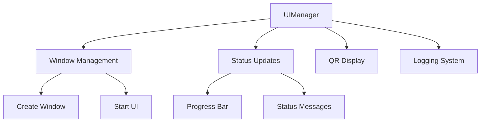
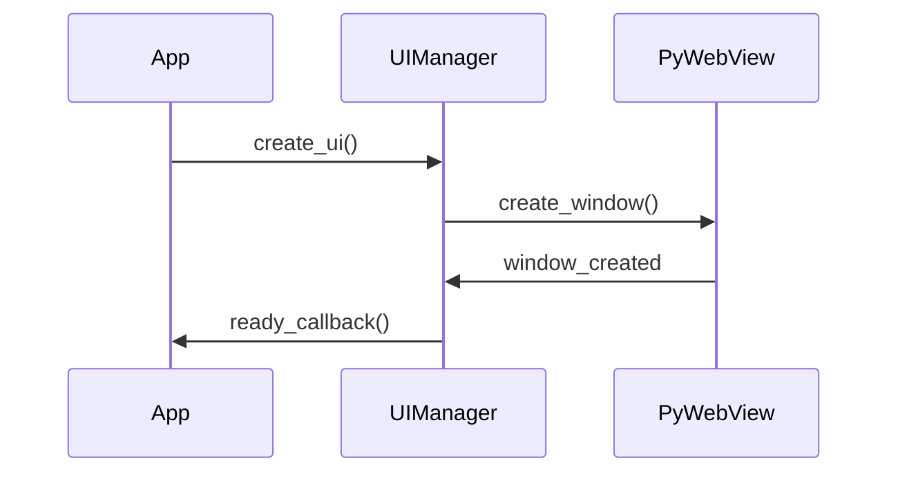

# UI Manager Documentation

## 🔍 Overview

The UI Manager component handles the PyWebView-based graphical interface, providing a responsive and user-friendly display system for the Raspberry Pi setup process.

## 🖥️ Core Components

### UIManager Class Structure


## 🎨 Interface Design

### HTML Template Features
```html
<style>
    /* Core UI Elements */
    .container {
        display: flex;
        flex-direction: column;
        gap: 20px;
    }
    
    /* Status Indicators */
    .status-pending { 
        background-color: #fff3cd; 
        animation: pulse 2s infinite;
    }
    
    /* Progress Bar */
    .progress-bar {
        background: linear-gradient(90deg, #4CAF50, #45a049);
        border-radius: 10px;
        transition: width 0.3s ease;
    }
</style>
```

## 🔧 Core Functions

### 1. Window Management
```python
def create_ui(self, ready_callback):
    """
    Creates and starts the PyWebView UI.
    
    Args:
        ready_callback: Function to execute when UI is ready
    """
```

### 2. Status Updates
```python
def update_status(self, message, status_type="pending"):
    """
    Update status display with different styles.
    
    Args:
        message: Status message
        status_type: 'pending', 'success', or 'error'
    """
```

### 3. QR Code Display
```python
def display_qr_code(self, image_path, message=None):
    """
    Display QR code using data URL approach.
    
    Args:
        image_path: Path to QR code image
        message: Optional description
    """
```

## 📊 Progress Tracking

### Progress Bar Management
```python
def update_progress(self, progress, show=True):
    """
    Update progress bar display.
    
    Args:
        progress: Percentage (0-100)
        show: Visibility toggle
    """
```

### Status Types
1. **Pending**
   - Pulsing animation
   - Yellow background
   - Loading indication

2. **Success**
   - Green background
   - Completion message
   - Fade transition

3. **Error**
   - Red background
   - Error details
   - Recovery options

## 📝 Logging System

### Message Logging
```python
def log_message(self, message, level="info"):
    """
    Enhanced logging with timestamp and styling.
    
    Args:
        message: Log content
        level: info, error, success, debug
    """
```

### Log Levels
- **Info**: General information
- **Success**: Completed operations
- **Error**: Failed operations
- **Debug**: Development details

## 🔄 UI Lifecycle

### 1. Initialization


### 2. Update Cycle
```python
def update_ui(self, message, image_path=None, max_retries=3):
    """
    Update UI with retry mechanism.
    
    Args:
        message: Display message
        image_path: Optional image
        max_retries: Retry attempts
    """
```

## 🎯 Error Handling

### 1. Window Creation
```python
try:
    self.window = webview.create_window(
        "Raspberry Pi Setup",
        html=self.html_template,
        fullscreen=True
    )
except Exception:
    # Fallback to windowed mode
    self.window = webview.create_window(
        "Raspberry Pi Setup",
        html=self.html_template,
        fullscreen=False,
        width=800,
        height=600
    )
```

### 2. Update Retries
```python
retries = 0
while retries < max_retries:
    try:
        self.log_message(message, image_path)
        return
    except Exception as e:
        retries += 1
        time.sleep(1)
```

## 🖼️ Image Handling

### Data URL Conversion
```python
def image_to_data_url(self, image_path):
    """
    Convert image to base64 data URL.
    
    Args:
        image_path: Path to image file
    Returns:
        str: Base64 data URL
    """
```

### QR Code Display
```python
def display_qr_code(self, image_path, message=None):
    """
    Display QR code with optional message.
    
    Args:
        image_path: QR code image path
        message: Optional description
    """
```

## 🔌 Integration Points

### 1. Access Point Mode
```python
def start_ap_mode(self):
    """
    Start AP mode with progress updates.
    - Initializes AP
    - Generates QR code
    - Updates progress
    - Handles errors
    """
```

### 2. System Integration
- Progress tracking
- Status updates
- Error handling
- QR code generation

## 📚 Development Guidelines

### 1. Adding UI Elements
1. Update HTML template
2. Add styling
3. Create update method
4. Implement error handling

### 2. Status Updates
1. Define status type
2. Create message
3. Update display
4. Handle transitions

## 🔗 Related Documentation
- [[Development Guide]] - Development setup
- [[System Architecture]] - System design
- [[API Documentation]] - API endpoints
- [[Scripts]] - Backend scripts
- [[Server]] - Server components

---
*Last updated: [Current Date]* 